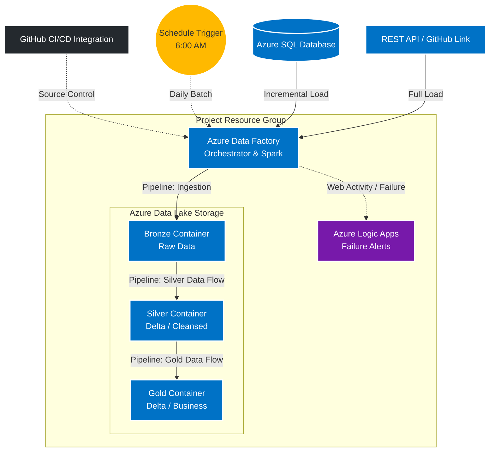

# ☁️ Azure Medallion Architecture: End-to-End Data Lakehouse

> An enterprise-grade data engineering project implementing the **Medallion Architecture (Bronze, Silver, Gold)**. This solution integrates an automated CI/CD lifecycle via GitHub, incremental data loading mechanisms, Spark-backed Data Flow transformations using the Delta file format, and proactive alerting via Azure Logic Apps.

---

## 🏗️ Architecture Overview

The pipeline extracts data from a relational SQL database and an external REST API, landing it raw into the Bronze layer. It is then transformed and modeled through the Silver and Gold layers using Spark clusters inside Azure Data Factory. An overarching master pipeline orchestrates the workflow and triggers external alerts on failure.

## 🚀 Deployed Resources

| Resource Type | Purpose in Project |
| :--- | :--- |
| **Azure Data Factory (ADF)** | The main orchestrator. It runs the data flows (Spark compute), pipelines, and incremental load logic. Connected to GitHub for CI/CD. |
| **Azure Storage Account (ADLS Gen2)** | The Data Lake housing three distinct containers: `bronze`, `silver`, and `gold`. |
| **Azure SQL Server & Database** | The primary relational source system for our transactional data. |
| **Azure Logic Apps** | Configured to receive HTTP requests (webhooks) from Data Factory and trigger automated email alerts if a pipeline fails. |
| **GitHub** | Integrated directly into ADF to implement CI/CD (Continuous Integration / Continuous Deployment) principles and version control. |

## 🏅 Medallion Architecture Implementation

This project heavily utilizes the Medallion Data Lakehouse pattern to progressively structure and clean the data.

1. **Bronze Layer (Raw):** Ingests raw data from our SQL DB and REST API as-is.
2. **Silver Layer (Cleansed/Transformed):** Uses ADF Mapping Data Flows to transform and mold the data. It is saved in the **Delta file format** using an *Inline Dataset* configuration to handle the open-source structure efficiently.
3. **Gold Layer (Curated/Modeled):** The polished layer. Uses ADF Data Flows to create Fact and Dimension models, as well as final business views. Also stored in Delta format using Inline Datasets.

## ⚙️ The 5 Core Pipelines

### 1. `API_Ingestion`
* Uses a **Web Activity** to ping the REST API (GitHub file link) and validate the response structure.
* Uses a **Copy Activity** to migrate the JSON/API data directly into the Bronze container.

### 2. `SQL_To_DataLake_Ingestion` (Incremental Load)
* Implements a **Watermarking (Incremental Load) technique** to avoid pulling the entire database every day.
* **Lookup 1:** Reads a configuration file in the Bronze container containing the "Last Load" timestamp (initially set to a dummy date like `1900-01-01`).
* **Lookup 2:** Queries the SQL database for the maximum timestamp (e.g., `MAX(updated_at)`), establishing the "Latest Load" target.
* **Copy Activity 1:** Extracts only the records from SQL where the timestamp falls between the Last Load and Latest Load dates, pushing them to Bronze.
* **Copy Activity 2:** Acts as a watermark updater, taking the "Latest Load" value and overwriting the configuration file so the next run knows where to start.

### 3. `SilverPipeline`
* Contains an ADF **Data Flow Activity** pointing to the Silver transformation logic, spinning up Spark clusters in the background to write Delta files.
  

**Silver Data Flow Details:**
This data flow handles the core transformations, molding the raw Bronze data into a clean, structured Delta format for the Silver layer.

### 4. `GoldPipeline`
* Contains an ADF **Data Flow Activity** executing the Gold modeling logic, processing Silver data into business-ready Facts and Dimensions.
  

**Gold Data Flow Details:**
This data flow executes the final business modeling, aggregating and preparing the Silver data for analytical consumption in the Gold layer.

### 5. `ProdPipeline` (Master Orchestrator)
* Scheduled to run every day at **6:00 AM**.
* Uses **Execute Pipeline Activities** to trigger `SQL_To_DataLake_Ingestion` and `API_Ingestion`. 
* Uses a **Web Activity** linked to the "Failure" path of the pipelines. If anything breaks, it sends an HTTP POST request to Azure Logic Apps to trigger an immediate alert.

## 🚧 Roadblocks & How I Fixed Them

* **Handling Delta Formats in ADF:** 
  * *The Issue:* Standard ADF datasets don't natively map to Delta table folder structures easily without complex manual schema definitions.
  * *The Fix:* I utilized **Inline Datasets** directly within the Sink settings of my Data Flows. This allowed the Spark backend to natively handle the Delta format, writing the Parquet files and transaction logs directly to the Silver and Gold containers without needing pre-defined dataset artifacts.
* **Watermark File Updates:**
  * *The Issue:* Updating the last-load date in a text/JSON file inside the Data Lake using a Copy Activity can sometimes append data instead of overwriting, breaking the incremental logic.
  * *The Fix:* Ensured the sink configuration on the watermark Copy Activity was set to explicitly overwrite the file, and passed the dynamic `MAX()` date from the SQL lookup directly into the sink parameters.
* **CI/CD Collaboration:**
  * *The Issue:* Keeping track of changes across 5 pipelines, data flows, and triggers.
  * *The Fix:* Connected ADF directly to a GitHub repository. This allowed me to save changes to feature branches, create pull requests, and enforce strict version control before publishing anything to the live Data Factory.
